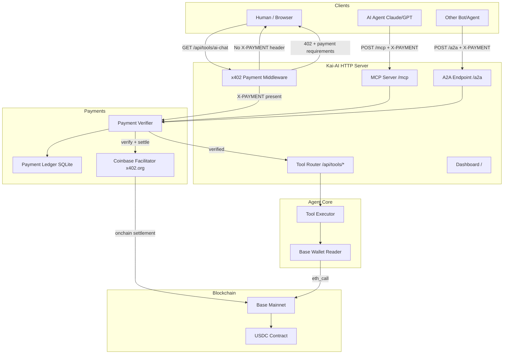

# 🤖 Kai-AI — Autonomous Agent on Base Mainnet

An autonomous AI agent with a Base blockchain wallet, x402 per-API-call payment middleware, MCP server, A2A protocol, and a full payment verification/ledger system.

> **Every tool call costs USDC on Base Mainnet. No API keys, no subscriptions — pure x402 crypto-native payments.**

---

## Architecture



---

## Features

| Feature | Description |
|---|---|
| **x402 Middleware** | Every `/api/tools/*` call returns HTTP 402 if unpaid |
| **Payment Verification** | Coinbase facilitator verifies + settles USDC on Base Mainnet |
| **Payment Ledger** | All verified payments stored in SQLite with tx hash |
| **MCP Server** | `/mcp` — JSON-RPC 2.0, tools/list + tools/call |
| **A2A Protocol** | `/a2a` — Agent-to-Agent task delegation with payment |
| **Agent Wallet** | Reads ETH + USDC balance from Base Mainnet |
| **A2A Registry** | Tracks every agent that has called Kai-AI |
| **Dashboard UI** | Real-time stats, payment ledger, tool catalog |
| **Demo Mode** | `/api/demo` — try tools without payment (limited) |

---

## Required Environment Variables

Set these in the Val Town project settings:

| Variable | Required | Description |
|---|---|---|
| `AGENT_WALLET_ADDRESS` | ✅ Yes | Your `0x...` wallet that receives USDC payments |
| `OPENAI_API_KEY` | ✅ Yes | OpenAI key for ai_chat, text_analysis, code_review, image_caption |
| `SERPER_API_KEY` | Optional | Serper.dev key for real-time web_search (falls back to OpenAI) |

### How to set your wallet address:
1. Create a wallet on [Coinbase Wallet](https://wallet.coinbase.com/) or any EVM wallet
2. Make sure it's on **Base Mainnet** (chain ID 8453)
3. Fund it with some ETH for gas (gas-free via EIP-3009 for USDC transfers)
4. Set `AGENT_WALLET_ADDRESS` = `0xYourAddress`

---

## API Endpoints

### Public (Free)
```
GET  /                        — Dashboard UI
GET  /.well-known/agent.json  — Agent card for A2A discovery
GET  /mcp                     — MCP server info
GET  /api/tools               — List all available tools + prices
GET  /api/stats               — Payment statistics
GET  /api/payments            — Payment ledger (last 20)
GET  /api/wallet              — Agent wallet balance
GET  /api/agents              — A2A agent registry
GET  /docs                    — API documentation
POST /api/demo                — Demo mode (no payment, limited)
```

### Paid (x402 — USDC on Base Mainnet)
```
GET/POST /api/tools/ai-chat        — $0.005 USDC
GET/POST /api/tools/market-data    — $0.002 USDC
GET/POST /api/tools/base-tx-lookup — $0.001 USDC
GET/POST /api/tools/wallet-balance — $0.001 USDC
GET/POST /api/tools/text-analysis  — $0.003 USDC
GET/POST /api/tools/web-search     — $0.005 USDC
GET/POST /api/tools/code-review    — $0.020 USDC
GET/POST /api/tools/image-caption  — $0.010 USDC
```

### Agent Protocols
```
POST /mcp   — MCP JSON-RPC (tools/list, tools/call + X-PAYMENT)
POST /a2a   — A2A task delegation (+ X-PAYMENT header)
```

---

## x402 Payment Flow

```
1. Client → GET /api/tools/ai-chat
   ← 402 Payment Required
      {
        "x402Version": 1,
        "accepts": [{
          "scheme": "exact",
          "network": "eip155:8453",         ← Base Mainnet
          "maxAmountRequired": "5000",       ← 5000 micro-USDC = $0.005
          "asset": "0x833589fCD6eDb6E08...", ← USDC on Base
          "payTo": "0xYourAgentWallet"
        }]
      }

2. Client signs EIP-3009 TransferWithAuthorization
   (gasless USDC transfer from client wallet to agent wallet)

3. Client → POST /api/tools/ai-chat
              X-PAYMENT: base64(signedPayload)
              Body: {"query": "Hello Kai!"}

4. Kai-AI → POST https://facilitator.x402.org/verify + /settle
   ← Payment verified and settled onchain

5. Kai-AI → 200 OK
              {"tool": "ai_chat", "result": {...}, "payment": {"verified": true}}
```

---

## MCP Integration (Claude / AI Agents)

Connect to Kai-AI as an MCP server. Tools will show up in your AI client with payment requirements:

```json
POST /mcp
{
  "jsonrpc": "2.0",
  "method": "tools/list",
  "id": 1
}
```

Returns all tools with `annotations.x402` price info. When calling a tool:

```json
POST /mcp
X-PAYMENT: <base64-payment-payload>
{
  "jsonrpc": "2.0",
  "method": "tools/call",
  "params": {
    "name": "ai_chat",
    "arguments": { "query": "Summarize Base blockchain news" }
  },
  "id": 2
}
```

---

## A2A Protocol

Other AI agents can call Kai-AI's services:

```json
POST /a2a
X-Agent-Address: 0xOtherAgentWallet
X-Agent-Name: MyBot
X-PAYMENT: <base64-payment-payload>

{
  "task": "market_data",
  "params": { "token": "ETH" },
  "callback_url": "https://mybot.example.com/callback"
}
```

Response:
```json
{
  "task": "market_data",
  "status": "completed",
  "result": { "price": 3200, "change_24h": 1.5, ... },
  "payment": { "verified": true, "txHash": "0x...", "amount": 0.002 }
}
```

---

## File Structure

```
Kai-AI/
├── main.ts                  — Hono HTTP server, x402 middleware, all routes
├── agent/
│   ├── core.ts              — Tool execution engine (8 tools)
│   ├── wallet.ts            — Base Mainnet wallet reader
│   └── mcp.ts               — MCP JSON-RPC 2.0 server
├── payments/
│   └── verifier.ts          — x402 verification, ledger, A2A tracking
├── database/
│   └── migrations.ts        — SQLite schema setup
├── frontend/
│   └── index.html           — Dashboard UI (Twind + vanilla JS)
└── README.md
```

---

## x402 Resources

- [x402.org](https://x402.org) — Official protocol site
- [Coinbase CDP x402 Docs](https://docs.cdp.coinbase.com/x402/welcome)
- [x402 GitHub](https://github.com/coinbase/x402)
- [Facilitator URL](https://facilitator.x402.org)

---

*Built on [Val Town](https://val.town) · Powered by [Base](https://base.org) · Payments via [x402](https://x402.org)*
